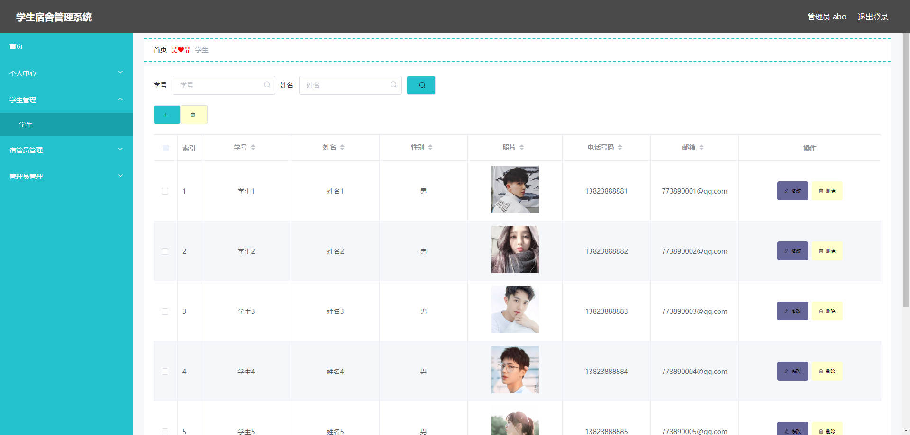
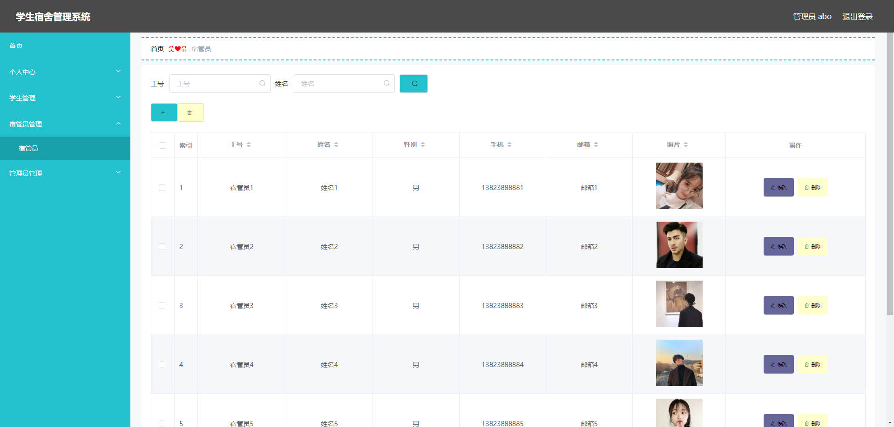
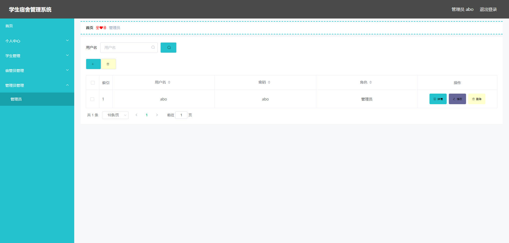
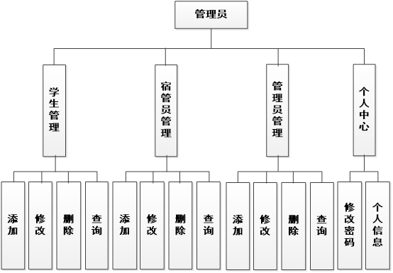
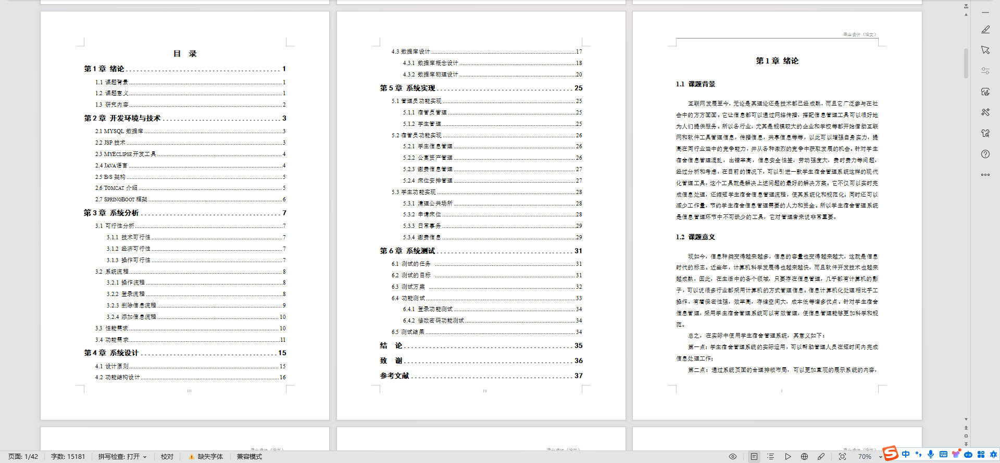

# 基于Springboot的学生宿舍管理系统

## Springboot-0023


## 技术栈

Springboot mybatisplus vue mysql maven


## 数据库表(13张)


## 功能介绍

```properties
系统可以提供信息显示和相应服务，其管理员管理宿管员，管理学生，修改密码，维护个人信息。宿管员管理公寓资产，缴费信息，公共场所清理信息，日常事务信息，审核学生床位安排信息。学生查看公共场所清理信息，日常事务，缴费信息，在线申请床位，查看床位安排。
```


## 图片

### 前台

### 后台







## 访问路径

### 前台

```properties

```

### 后台

```properties
http://localhost:8080/springboott7kpr/admin/dist/index.html#/login

账号 abo
密码 abo
```


## 功能图




## 文档目录




## 打赏或交流


